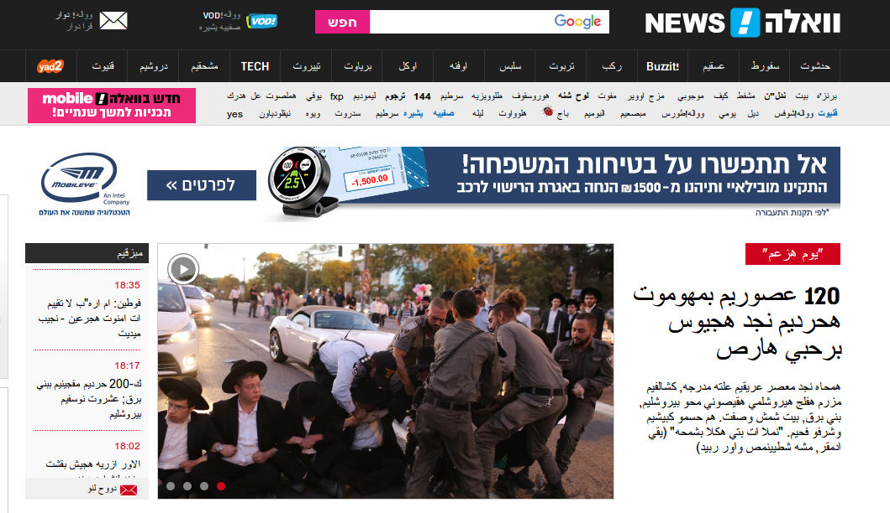
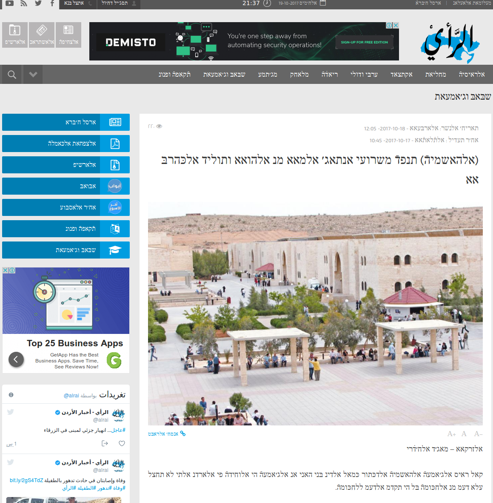
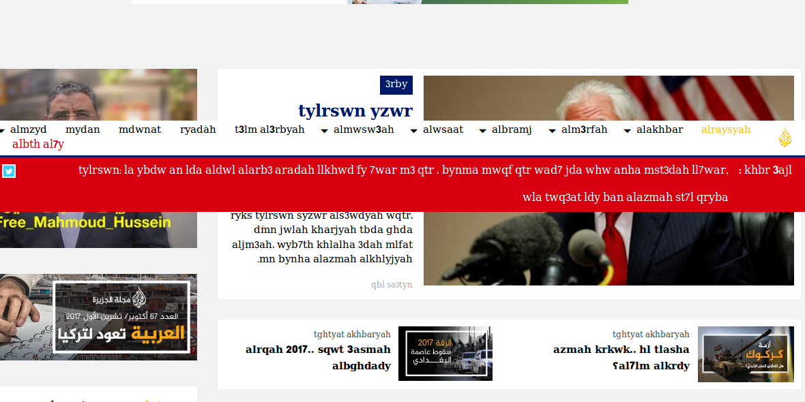
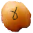

# ta3atiq

## What is this

*ta3atiq* is a Browser extension that transcripts web pages.

Current supported transcriptions:

* from Hebrew to Arabic
* from Arabic to Hebrew
* from Arabic to Chat Arabic (latin)

### Transcription rules are based on:

* Arabic to Hebrew by the [hebrew academy](http://hebrew-academy.org.il/wp-content/uploads/Transcription2_3.pdf).
* Hebrew to Arabic free style.
* Arabic to Chat Arabic from [wikipedia](https://en.wikipedia.org/wiki/Arabic_chat_alphabet).

## Sample pages

[Walla](http://walla.co.il) in Arabic:

[Alrai](http://alrai.com/) in Hebrew:

[Aljazeera](http://www.aljazeera.net/portal) in Chat Arabic:

## How to use and configuration:

1. once extension is loaded, when page has loaded completely, click the 'Hummus' symbol () in the URL line:
1. click it again to see the original text.
3. to change the language, see the add-on prefrences page.

