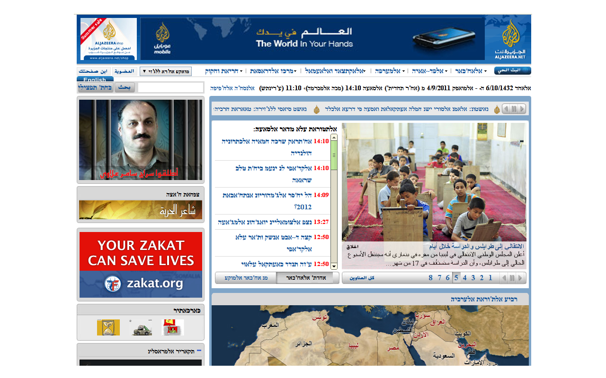

# ta3atiq
Display Arabic pages with Hebrew letters

## What is this
Chrome extension that converts pages written in Arabic to Hebrew letter (transcriptted).

### Sample page
This is how Algazeera looks like:

## Installation
See here: https://github.com/dtylman/ta3atiq/wiki/Installation
